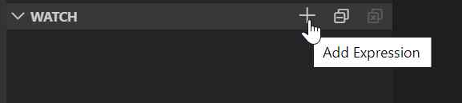
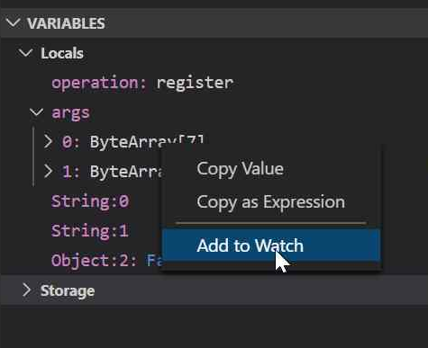
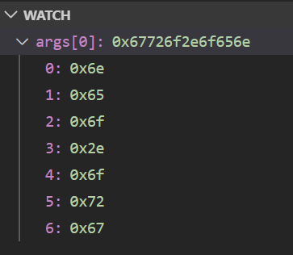
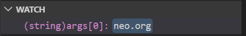
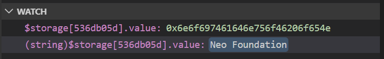

# Neo Smart Contract Debugger Variable Evaluation Reference

The Neo Smart Contract Debugger uses information in the
[Neo Virtual Machine](https://github.com/neo-project/neo-vm) as well as the
[debug info file](https://github.com/ngdseattle/design-notes/blob/master/NDX-DN11%20-%20NEO%20Debug%20Info%20Specification.md)
generated by the smart contract compiler to display variables in the
[Visual Studio Code Data Inspection Window](https://code.visualstudio.com/docs/editor/debugging#_data-inspection).
However, developers sometimes need finer grained control over how the
variables are displayed in the IDE. Developers can better control
how variables are displayed by adding them to the Watch window and applying
a cast operation.

> Note, the screenshots in this document are using the
> [C# Domain smart contract sample](https://github.com/ngdseattle/domain-sample)

There are two ways of adding a variable to the watch window

* Selecting the `Add Expression` command from the Watch window toolbar

* Selecting `Add to Watch` command from the Variable context menu

Once a variable has been added to the Watch window, the developer can
control how it is displayed by adding a cast operator. By default,
the watch window displays the variable the same way that the variables
window does. In this example, the `args[0]` variable is displayed as a
byte array.

The developer can apply a cast operator to control how the variable is
displayed. In this example, the `args[0]` variable is actually a string.
The developer can add `(string)` cast operator to the watched variable
to control it's appearance.

The Neo Smart Contract Debugger supports the following cast operators
in the watch window.

| Cast Operation | Data Type |
| -------------- | --------- |
| `(int)`        | Integer   |
| `(bool)`       | Boolean   |
| `(string)`     | String    |
| `(hex)`        | Hex encoded string |
| `(byte[])`     | Byte Array |

Storage variables can also be added to the watch window and they also support
cast operators. Storage slots are specified with the special marker `$storage`
followed by an index operator. The storage index value is calculated from the
storage slot key, so it will be different than the key value but it will remain
stable relative to the key value.

In this example, we see the `$storage[536db05d].value` both as a byte array and
as a string.

> Note, `$storage` variable uses a custom calculated key value because actual
> key values can be arbitrarily long. The custom calculated key is always eight
> characters long, regardless of how long the actual key is. This ensures the
> key specification in the variable and watch windows takes up a minimal amount
> of screen space.
