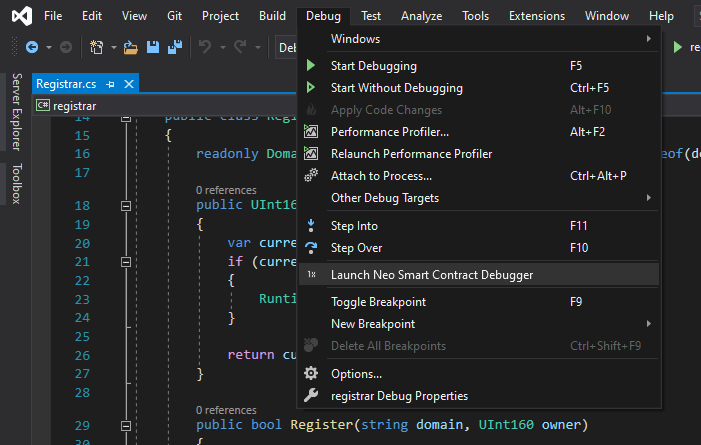

# Neo Smart Contract Debugger for Visual Studio

> Note, Neo Smart Contract Debugger for Visual Studio is in preview. 
> Please file issues on [GitHub](https://github.com/neo-project/neo-debugger/issues).

In order to use the Neo Smart Contract Debugger for Visual Studio, you must have a VS compatible
project open, such as C#. Current previews of the Neo Smart Contract Debugger do not yet support
Visual Studio's "Open Folder" mode.

Within the VS project, the Neo Smart Contract Debugger looks for files named `launch*.json`. These
json files must contain either a single launch configuration ([example](https://github.com/ngdenterprise/neo-registrar-sample))
or [VSCode compatible launch configurations](https://go.microsoft.com/fwlink/?linkid=830387).
The individual launch configurations support [the same properties](debug-config-reference.md)
as the Neo Smart Contract Debugger for VSCode. To indicate that a given launch configuration
supports the Neo Smart Contract Debugger, it must specify it's type as `neo-contract` ([example](https://github.com/ngdenterprise/neo-registrar-sample/blob/master/.vscode/launch.json#L41))

The debugger is launched by selecting "Launch Neo Smart Contract Debugger" from the top level Debug menu in Visual Studio

